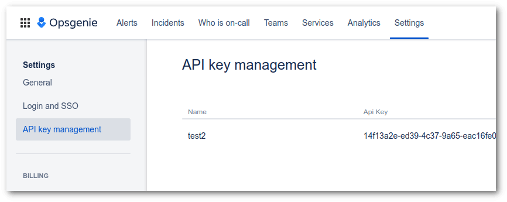

# OpsGenie Notifications Channel for Laravel

[](https://github.com/artkonekt/opsgenie-laravel/actions?query=workflow%3Atests)
[](https://packagist.org/packages/konekt/opsgenie-laravel)
[](https://packagist.org/packages/konekt/opsgenie-laravel)
[](https://styleci.io/repos/389939873)
[](LICENSE.md)

This package enables Laravel 8+ Applications to send notification to OpsGenie.

## Installation

```bash
composer require konekt/opsgenie-laravel
```

### Configuration

Add your Auth Token, and endpoint config to your application's `config/services.php`:

```php
// config/services.php
...

'opsgenie' => [
    'auth_token' => env('OPSGENIE_AUTH_TOKEN'),
    'europe' => true, // OPTIONAL: if true, then the EU API endpoint will be used
    // 'endpoint' => 'https://some.custom.endpoint/', // VERY OPTIONAL: in case you use a non-official endpoint
],
...
```

#### A Note on The OpsGenie API Key

To create an alert, you need an API key from an
<span style="color:green">**API Integration ✔**</span> and
<span style="color:red">**NOT a "normal" API key ❌**</span>.

Normal API keys can be found at Settings -> API key management:



Integration API keys can be fount ad Teams -> {TEAM} -> Integrations:


> See more details at [this Atlassian Forum Thread](https://community.atlassian.com/t5/Opsgenie-questions/API-authentication-for-create-alerts/qaq-p/1477556#M773)

## Usage

### Laravel Notifications

You can use the OpsGenie channel in your `via()` method inside a
Notification class. The following example creates an alert with the
given message at OpsGenie:

```php
use Illuminate\Notifications\Notification;
use Konekt\OpsGenie\Commands\CreateAlert;
use Konekt\OpsGenie\Contracts\OpsGenieCommand;
use Konekt\OpsGenie\Contracts\OpsGenieNotification;
use Konekt\OpsGenie\Notification\OpsGenieChannel;

class SiteProblem extends Notification implements OpsGenieNotification
{
    private string $message;

    public function __construct(string $message)
    {
        $this->message = $message;
    }

    public function via($notifiable)
    {
        return [OpsGenieChannel::class];
    }

    public function toOpsGenie($notifiable): OpsGenieCommand
    {
        return new CreateAlert($this->message);
    }
}
```

To trigger the sending of the notification, use:

```php
Notification::send(['*'], new SiteProblem('Hey, there is a problem here'));
```